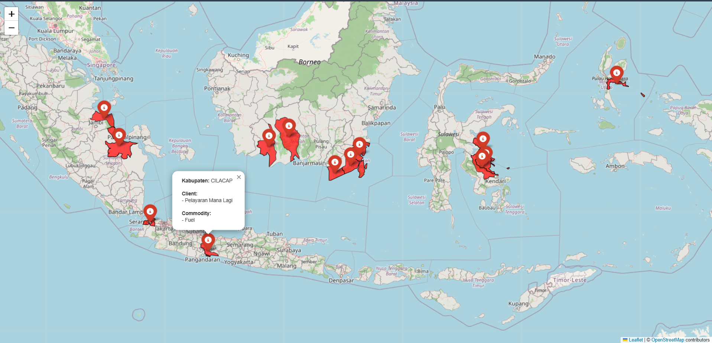

# Interactive GIS Client Distribution Map Indonesia

Interactive web-based GIS project for visualizing client and commodity distribution across Indonesia using Python, GeoPandas, Folium, and OpenStreetMap.

---

## Live Demo

https://mirfanramadhan227-prog.github.io/indonesia-client-distribution-map/

---

## Preview



---

## Features

- Interactive Indonesia GIS map
- Kabupaten boundary visualization
- Client distribution mapping
- Commodity distribution mapping
- Interactive popup information
- Dynamic spatial data processing
- Web GIS deployment using GitHub Pages

---

## Technologies Used

- Python
- GeoPandas
- Pandas
- Folium
- OpenStreetMap
- GeoJSON
- GitHub Pages

---

## Project Structure

```bash
app.py
data.xlsx
index.html
GeoJson-Indonesia-38-Provinsi/
images/
README.md
```

---

## Workflow

1. Read Excel client data
2. Read Indonesia GeoJSON boundary
3. Merge spatial and tabular data
4. Generate interactive web GIS
5. Deploy to GitHub Pages

---

## Author

Muhammad Irfan Ramadhan

GIS • Mapping • Survey • Data Engineering
